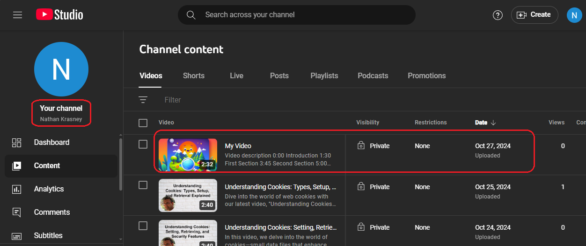

<h2>Motivation</h2>
Experiment (POC) with youtube api (server side only) to access and modify private youtube channel data 

<ul>
<li>upload video : title , description , tags , defaultAudioLanguage , defaultLanguage , privacyStatus , selfDeclaredMadeForKids</li>
<li>upload thumbnail</li>
<li>upload playlist</li>
</ul>

<h2>Setup </h2>
Follow these steps for successfull project setup

<h3>Google cloud console project</h3>
<ol>
<li>create a google clode console project</li>
<li>enable google api</li>
<li>Use OAuth2</li>
<li>Add scopes : https://www.googleapis.com/auth/youtube.upload </li>
</ol>

<h3>YouTube channel owner</h3>
verify your phone number is required to upload custom thumbnail (might be done by loading manually thumbnail to existing video)

<h3>Packages</h3>
Install the project packages as follows

```bash
pnpm i 
```

You can also use npm

<h2>Usage</h2>
Follow these steps for success usage

<ol>
<li>
run the express server using

```bash
npm run dev
```

</li>
<li>wait for running message : 'Server is running on http://localhost:3000/auth' in the terminal</li>
<li>open the browser and access http://localhost:3000/auth</li>
<li>sign in using your google account (nathan@nathankrasney.com in my case) as shown in the following figure


</li>
<li>You will be requested to supply additional access to your Google Account .'Auto YouTube Video Upload' is my google cloud project name as shown in the following figure


</li>
<li>click continue</li>
<li>check the console for message, in case of success it might take few minutes for the video to appear in the authenticated account YouTube account (nathan@nathankrasney.com in my case)


</li>
<li>Enter you youtube account via <a href='https://studio.youtube.com'>https://studio.youtube.com/</a>  and see that the video is loaded as shown in this figure 



</li>
</ol>

<h2>Design</h2>
This POC design is composed of few technoogies , enspoints and credentials.json file

<h3>Technologies</h3>
<ul>
<li>express - to implement a server</li>
<li>OAuth2 - to authenticate ourself o google so will can update our youtube private data</li>
<li>googleapis - to upload data e.g. video to our youtube channel</li>
</ul>


<h3>Endpoints</h3>
<ul>
<li>http://localhost:3000/auth is used for authentication </li>
<li>later if ok redirect to http://localhost:3000/oauth2callback </li>
</ul>

You define the callback endpoint in the Google cloud console project while /auth is your choice because it is initiated from you client

<h3>credentials.json</h3>
This is a file that you download from Google cloud console project . You can see there e.g. the callback under redirect_uris


credentials.json appears in .gitignore because this is sensitive data you do not to share publically

<h2>Points of interest</h2>

<ul>
<li>npm run test will invoke a test for uploadVideo function using mock of googleapi because we want to check the logic around it without consuming google api quota. The following figure show the test result


</li>
</ul>
