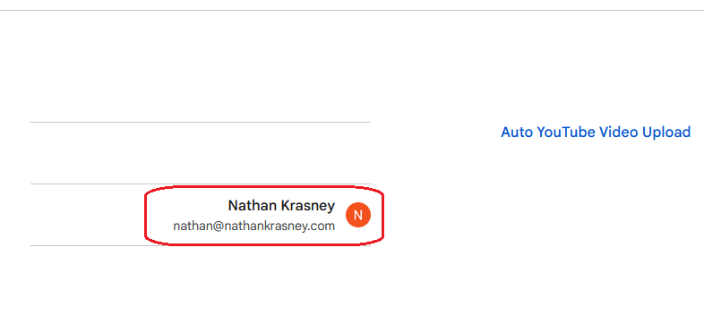
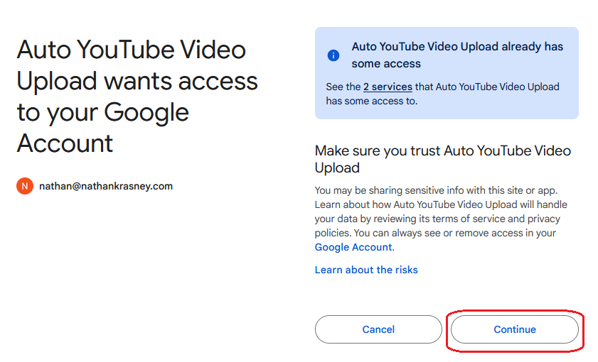
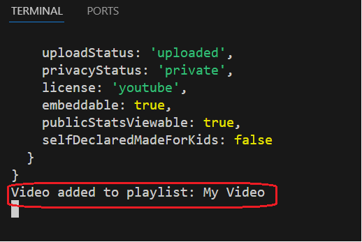
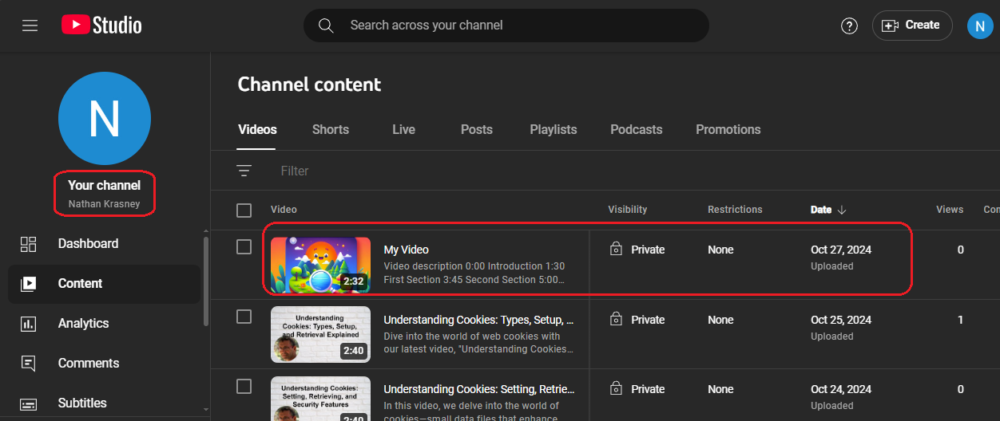
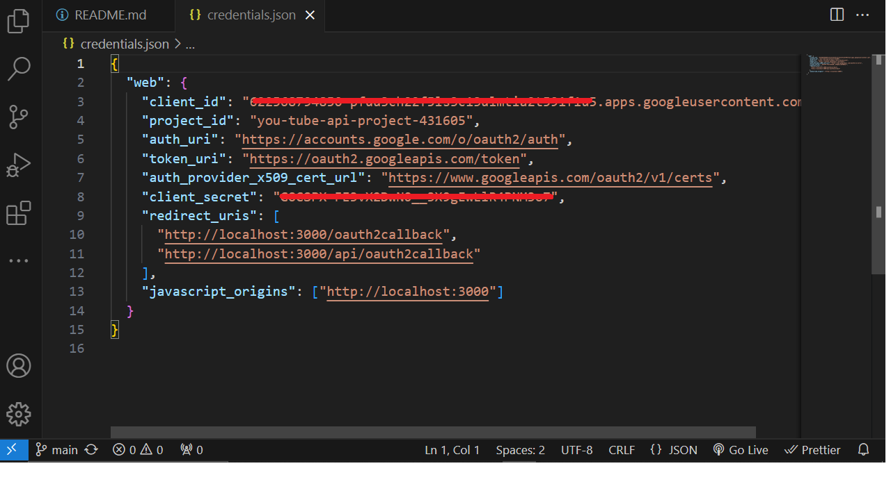
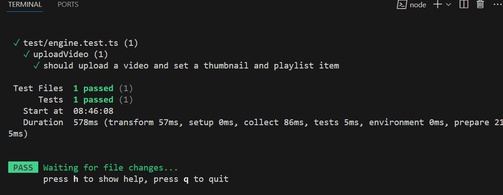

<h2>Motivation</h2>
  Experiment (POC) with YouTube API (server-side only) to access and modify private YouTube channel data:
  <ul>
    <li>upload video: title, description, tags, defaultAudioLanguage, defaultLanguage, privacyStatus, selfDeclaredMadeForKids</li>
    <li>upload thumbnail</li>
    <li>upload playlist</li>
  </ul>

<h2>Setup </h2>
Follow these steps for a successful project setup:

<h3>Google Cloud Console Project</h3>
  <ol>
    <li>Create a Google Cloud Console project.</li>
    <li>Enable Google API.</li>
    <li>Use OAuth2.</li>
    <li>Add scopes: <code>https://www.googleapis.com/auth/youtube.upload</code></li>
  </ol>

<h3>YouTube Channel Owner</h3>
  Verify your phone number is required to upload custom thumbnails (this might be done by loading a thumbnail manually to an existing video).


<h3>Packages</h3>
  Install the project packages as follows:

```bash

pnpm i

```

You can also use npm

<h2>Usage</h2>
Follow these steps for successful usage:

<h3>Step 1</h3>
Run the express server using:
<pre><code>npm run dev</code></pre>

<h3>Step 2</h3>
Wait for the running message: 'Server is running on <a href="http://localhost:3000/auth">http://localhost:3000/auth</a>' in the terminal.

<h3>Step 3</h3>
Open the browser and access <a href="http://localhost:3000/auth">http://localhost:3000/auth</a>.

<h3>Step 4</h3>
Sign in using your Google account (nathan@nathankrasney.com in my case) as shown in the following figure:


<h3>Step 5</h3>
You will be requested to supply additional access to your Google Account. 'Auto YouTube Video Upload' is my Google Cloud project name as shown in the following figure:


<h3>Step 6</h3>
Click continue.

<h3>Step 7</h3>
Check the console for a message. In case of success, it might take a few minutes for the video to appear in the authenticated YouTube account (nathan@nathankrasney.com in my case):


<h3>Step 8</h3>
Enter your YouTube account via <a href="https://studio.youtube.com/">YouTube Studio</a> and see that the video is loaded as shown in this figure:



<h2>Design</h2>
  This POC design is composed of a few technologies, endpoints, and a <code>credentials.json</code> file.

<h3>Technologies</h3>
  <ul>
    <li>express - to implement a server</li>
    <li>OAuth2 - to authenticate ourselves to Google so we can update our YouTube private data</li>
    <li>googleapis - to upload data e.g. video to our YouTube channel</li>
  </ul>

<h3>Endpoints</h3>
<ul>
<li>http://localhost:3000/auth is used for authentication </li>
<li>http://localhost:3000/oauth2callback is used later if ok redirect to </li>
</ul>

  You define the callback endpoint in the Google Cloud Console project while <code>/auth</code> is your choice because it is initiated from your client.

<h3>credentials.json</h3>
  This is a file that you download from Google Cloud Console project. You can see, e.g., the callback under <code>redirect_uris</code>:
  
  
  <code>credentials.json</code> appears in <code>.gitignore</code> because this is sensitive data you do not want to share publicly.

<h2>Code</h2>
The following are worth mentioning code snippets:

<h3>auth endpoint</h3>
Route to start the OAuth process:

```ts

app.get("/auth", (req: Request, res: Response) => {
  res.redirect(authorizationURL);
});

```

<h3>oauth2callback endpoint</h3>
Route to handle OAuth2 callback:

```ts

app.get("/oauth2callback", async (req: Request, res: Response) => {
  const code = req.query.code as string;
  if (code) {
    try {
      const { tokens } = await oauth2Client.getToken(code);
      oauth2Client.setCredentials(tokens);
      res.send("Authentication successful! Access token is logged.");
      console.log("Access token:", tokens.access_token);
      .....
    
```

<code>/oauth2callback</code> is defined in the Google Cloud project and must appear in the <code>credentials.json</code> file


<h2>Points of Interest</h2>
  <ul>
    <li><code>npm run test</code> will invoke a test for the <code>uploadVideo</code> function using a mock of googleapi because we want to check the logic around it without consuming Google API quota. The following figure shows the test result:
      
    </li>
    <li>notice that for production you need to add the matching oauth2callback endpoint in credentials.json, http://localhost:3000/oauth2callback will not do</li>
  </ul>